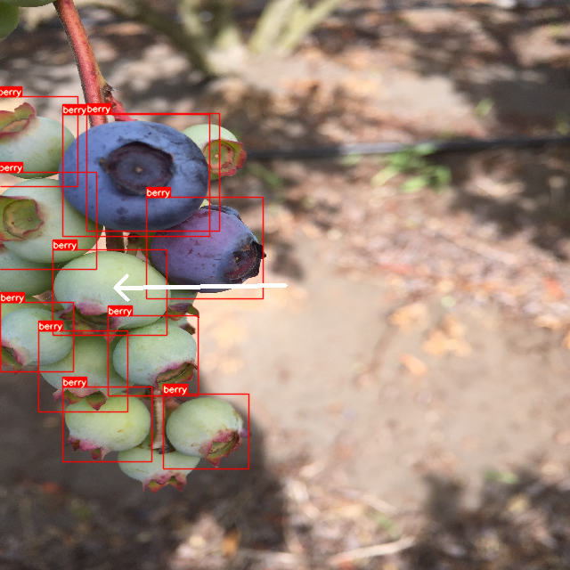

# Robust Co-Design of Canonical Underactuated Systems for Increased Certifiable Stability

This repository contains the code, data and plots of the project that I am implementing for openIoT Lab (FBK).

### Abstract
The OpenIoT research group has a ROS/ROS2-based mobile robot based on the JPL OpenRover open-source project. The rover carries a detachable sensing platform composed of an RGB camera and a 4 DoF robotic arm from the OpenManipulator series and is also ROS/ROS2-enabled. Using this platform, the final goal of the internship is to develop a ROS module that can use the camera to detect/count fruits. To ease the initial assessment of the developed system, an existent dataset comprising 1000+ still images of blueberries will be used. 

### Content
In the [src/python](src/python/) folder the user can find all the code necessary to generate the obtained results.
Results can be obtained by running

    python src/python/softDetection.py

The ML models that are contained in [models](models) have been created and tested in [Edge Impulse](https://studio.edgeimpulse.com).

### Installation
The use of a virtual environment for the installation is suggested as a common good programming choice. For example, the use of *pipenv* requires the following commands

    pipenv shell
    pipenv install -r software/python/requirements.txt

### Results

### Aknowledgements
The data contained in the "dataset" folder have been taken from the [Deepblueberry](https://ieeexplore.ieee.org/abstract/document/8787818) dataset for research purposes.

